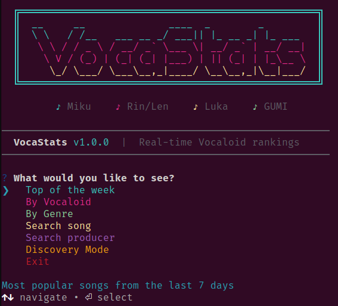
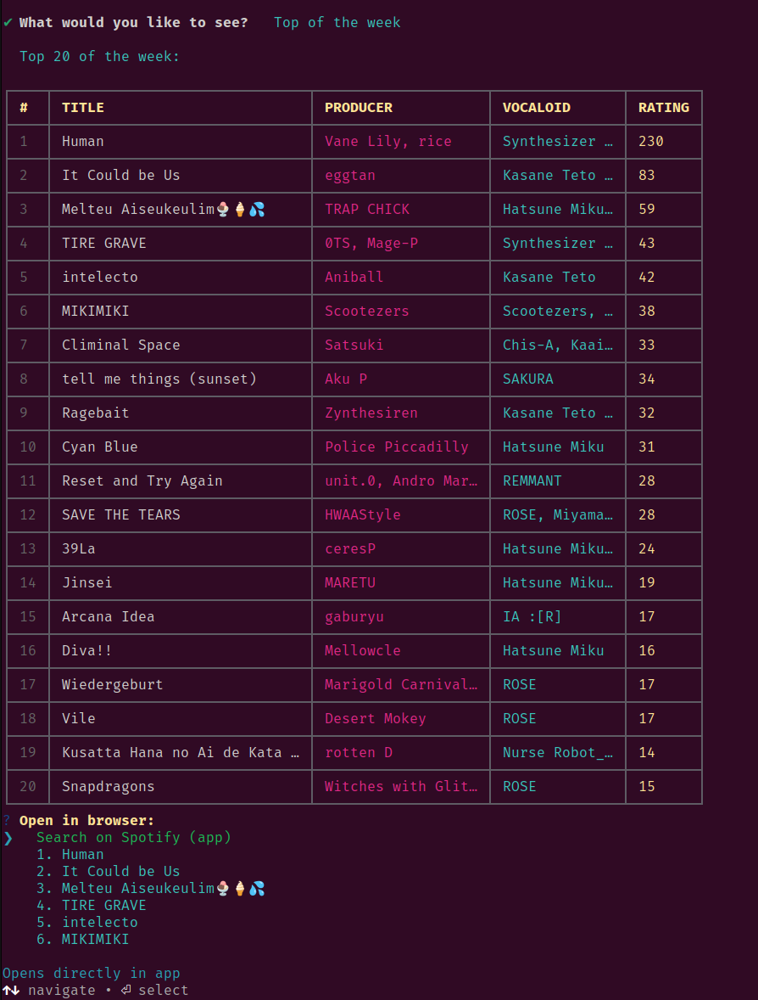

# VocaStats

TUI for tracking Vocaloid song rankings and statistics in real-time.

```
  ╔══════════════════════════════════════════════════╗
  ║  __     __              ____  _        _         ║
  ║  \ \   / /__   ___ __ _/ ___|| |_ __ _| |_ ___   ║
  ║   \ \ / / _ \ / __/ _` \___ \| __/ _` | __/ __|  ║
  ║    \ V / (_) | (_| (_| |___) | || (_| | |_\__ \  ║
  ║     \_/ \___/ \___\__,_|____/ \__\__,_|\__|___/  ║
  ╚══════════════════════════════════════════════════╝
```

## Features

- Top songs of the week
- Filter by Vocaloid (Miku, Rin, Len, Luka, GUMI, etc.)
- Filter by genre (Rock, Pop, EDM, Metal, etc.)
- Search by song name
- Search by producer
- Discovery mode (random highly-rated songs)
- Open links on YouTube/Niconico
- Search on Spotify (detects if app is installed)

## Requirements

- Node.js 18+

## Installation

### Via npm (recommended)

```bash
npm install -g vocastats-tui
```

### Via npx (no installation)

```bash
npx vocastats-tui
```

### Update

```bash
npm update -g vocastats-tui
```

## Usage

After installation, run from anywhere:

```bash
vocastats
```

## Navigation

- Use arrow keys ↑↓ to navigate menus
- Enter to select
- Ctrl+C to exit at any time

## Screenshots




## Uninstall

```bash
npm uninstall -g vocastats-tui
```

## Data

Data is fetched from the public [VocaDB](https://vocadb.net) API.

## License

MIT
